# Task-Vector R-Zero Delta Geometry Report

## Scope and definitions

This report uses the run-faithful definitions:

- Questioner: `Q1 - Base`, then `Qi - Q(i-1)`.
- Solver primary: `RELEX_Ri - Base`.
- Solver control: `BaseFit_Ai_step15 - Base`.

Input fingerprint: `90e17bae6930c296bea4b17ff93c954e9000c759b7a2a4d1e8c44a85d16f66ee`
Floating parameter count: `4022468096`
Compute device: `cuda:0`

Q1 is a bootstrap Questioner. Since its pre-training checkpoint is unavailable locally, Base is used as its baseline.

## A. Questioner: actual full-delta evolution

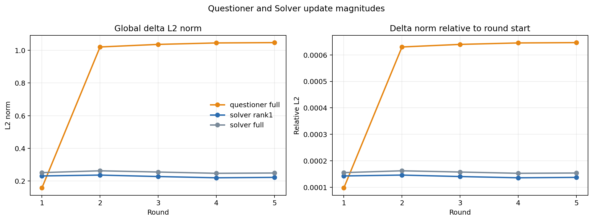

*Global and relative delta magnitudes.*

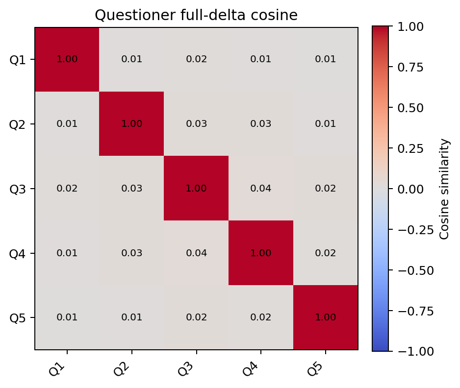

*Pairwise Questioner full-delta cosine similarity.*

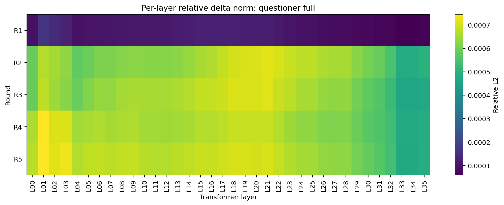

*Questioner relative update by transformer layer.*

## B. Solver: actual rank1-delta evolution

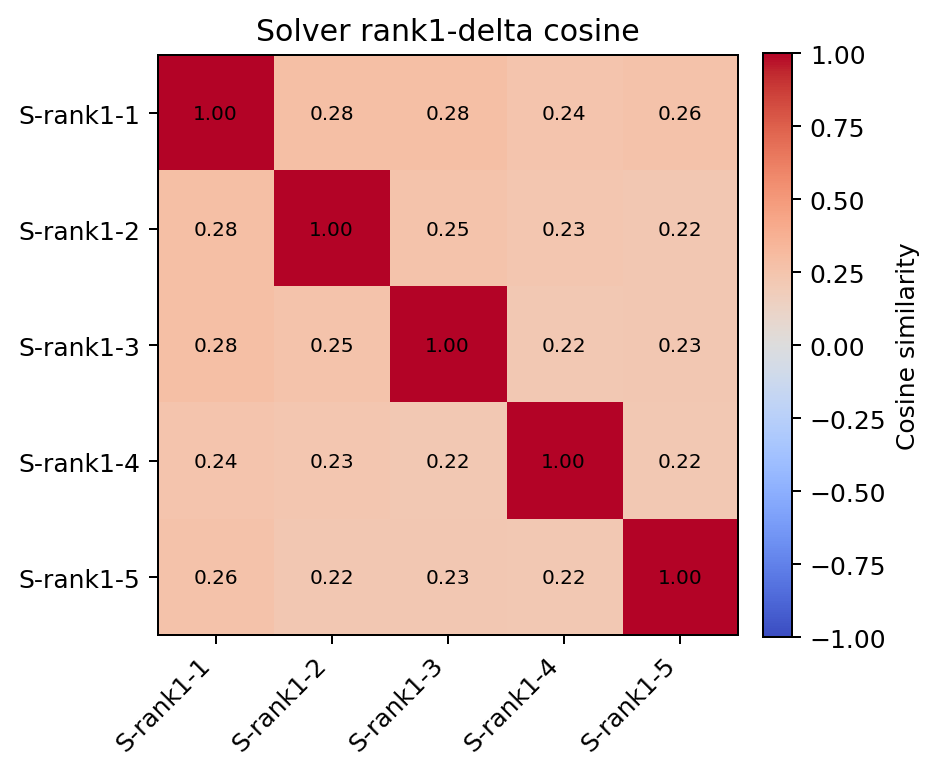

*Pairwise Solver rank1-delta cosine similarity.*

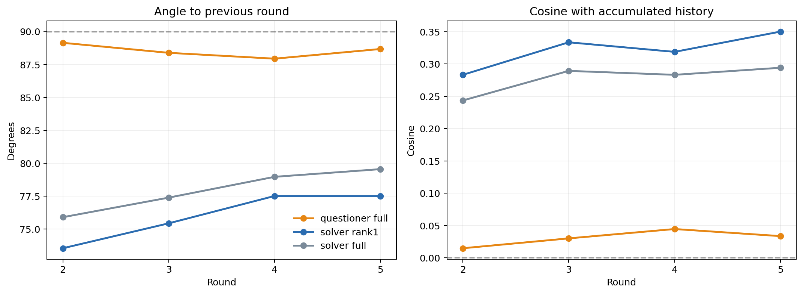

*Adjacent-round turns and alignment with accumulated history.*

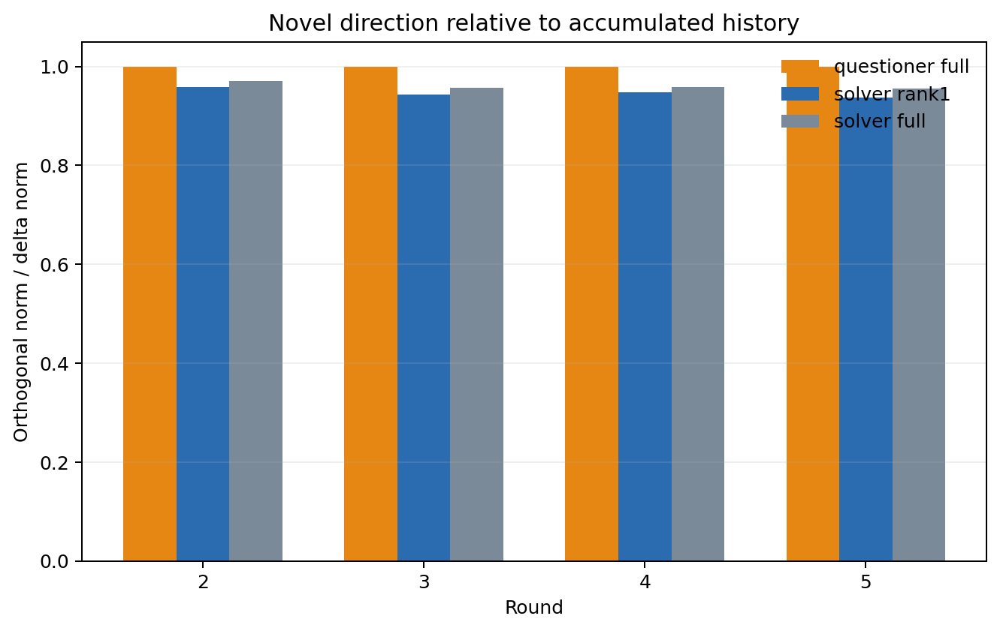

*Fraction of each update orthogonal to accumulated history.*

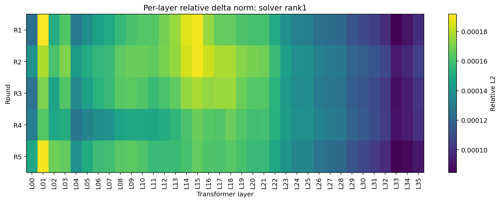

*Solver rank1 relative update by transformer layer.*

## C. RELEX: full delta to rank1 delta

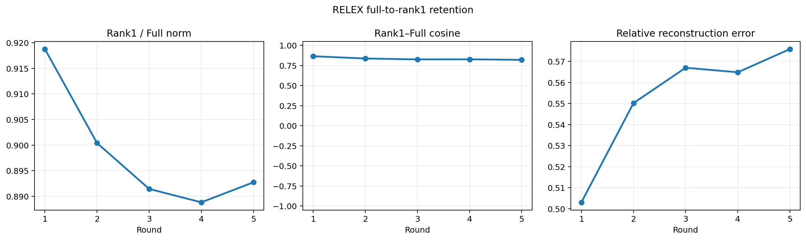

*RELEX magnitude, direction, and reconstruction retention.*

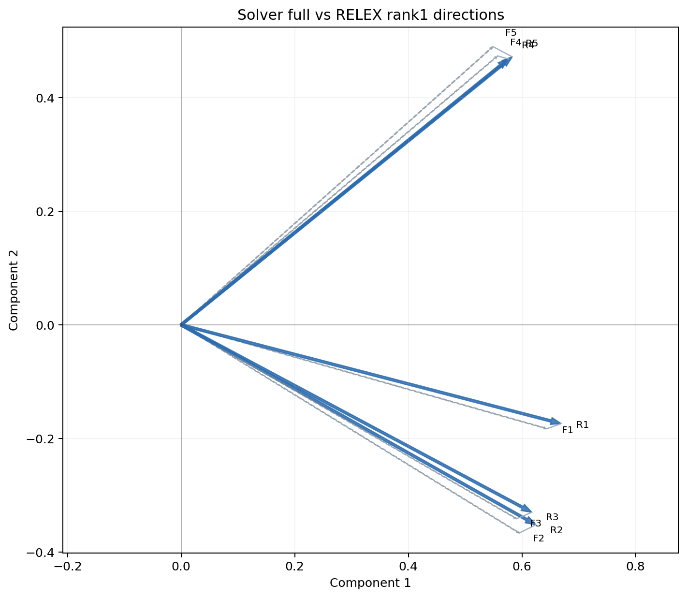

*Paired full and rank1 directions in a shared exact SVD plane.*

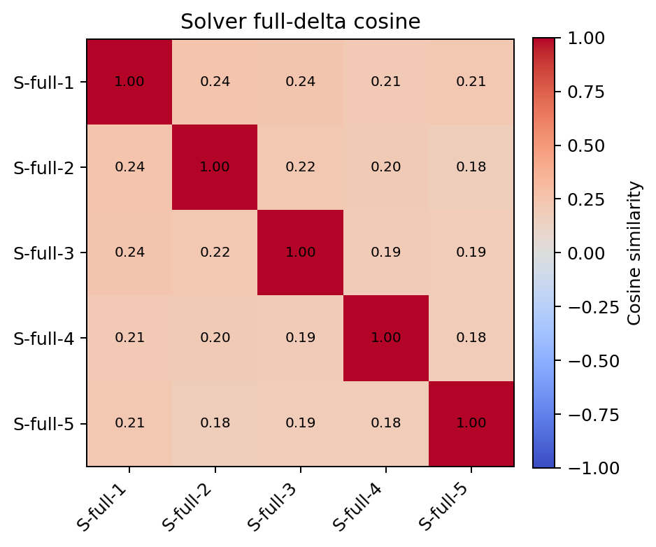

*Pairwise Solver full-delta cosine similarity.*

### RELEX summary

| round | rank/full norm | cosine | angle | relative error |
| --- | --- | --- | --- | --- |
| 1 | 0.91877 | 0.86587 | 30.02 | 0.50306 |
| 2 | 0.9004 | 0.8374 | 33.13 | 0.55021 |
| 3 | 0.89142 | 0.82628 | 34.28 | 0.56701 |
| 4 | 0.88881 | 0.82747 | 34.16 | 0.56485 |
| 5 | 0.89272 | 0.82071 | 34.84 | 0.57586 |

### Composed Solver consistency

| round | actual/intended cosine | relative residual |
| --- | --- | --- |
| 1 | 1 | 0 |
| 2 | 0.99978 | 0.02119 |
| 3 | 0.99979 | 0.020527 |
| 4 | 0.99979 | 0.020639 |
| 5 | 0.9998 | 0.019794 |

## D. Cross-family geometry

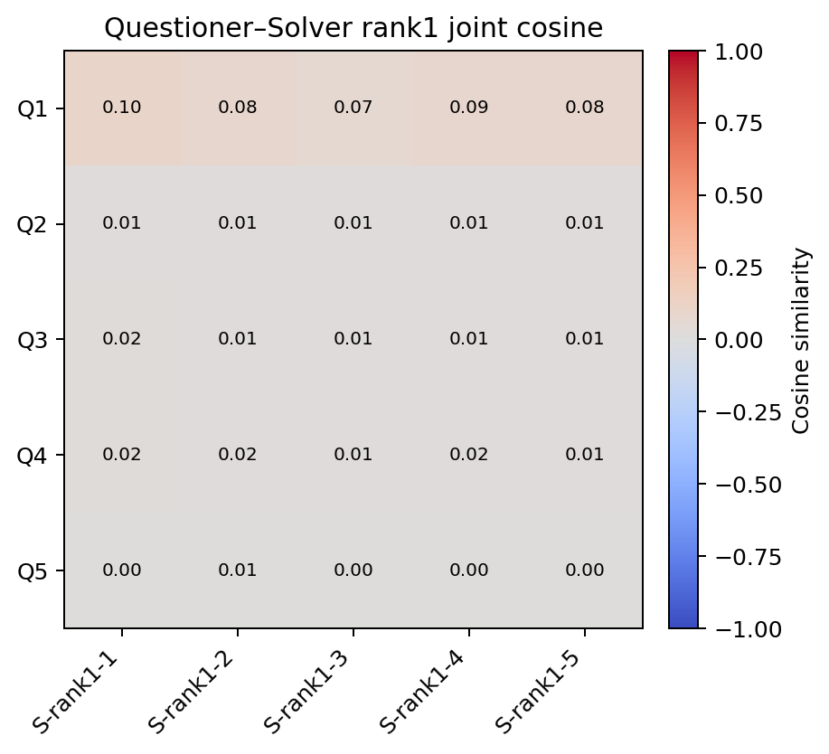

*Questioner full and Solver rank1 joint cosine matrix.*

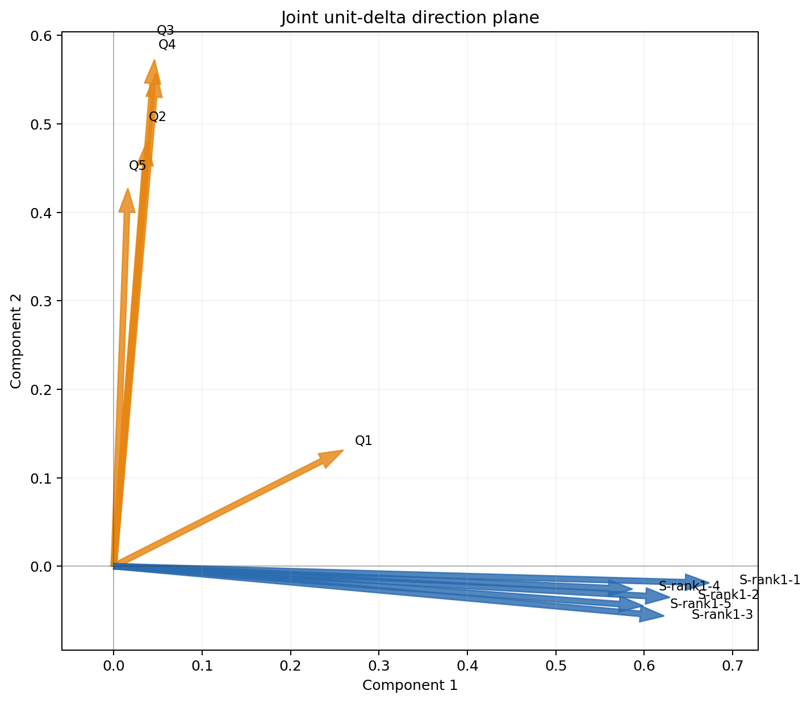

*Joint unit-delta direction plane.*

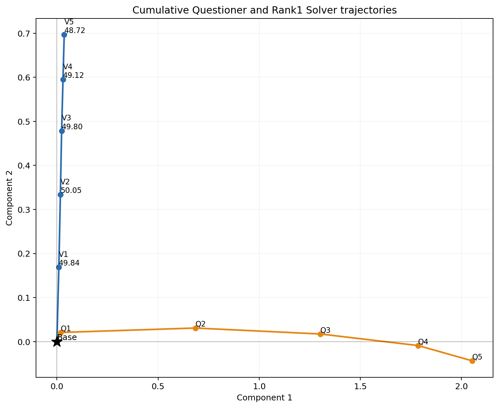

*Cumulative Questioner and Rank1 Solver trajectories.*

### Alignment with accumulated history

| family | round | history cosine | angle | orthogonal ratio |
| --- | --- | --- | --- | --- |
| questioner_full | 2 | 0.014867 | 89.15 | 0.99989 |
| questioner_full | 3 | 0.030129 | 88.27 | 0.99955 |
| questioner_full | 4 | 0.044602 | 87.44 | 0.999 |
| questioner_full | 5 | 0.033646 | 88.07 | 0.99943 |
| solver_rank1 | 2 | 0.28334 | 73.54 | 0.95902 |
| solver_rank1 | 3 | 0.33368 | 70.51 | 0.94269 |
| solver_rank1 | 4 | 0.31885 | 71.41 | 0.94781 |
| solver_rank1 | 5 | 0.35022 | 69.5 | 0.93667 |
| solver_full | 2 | 0.24363 | 75.9 | 0.96987 |
| solver_full | 3 | 0.28942 | 73.18 | 0.9572 |
| solver_full | 4 | 0.28331 | 73.54 | 0.95903 |
| solver_full | 5 | 0.29426 | 72.89 | 0.95572 |

## E. Evaluation and geometry

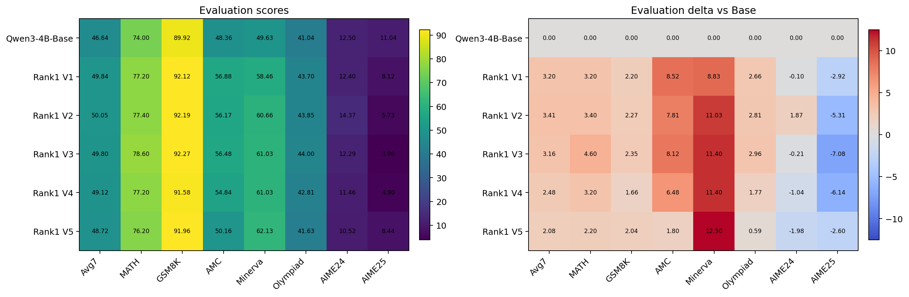

*Rank1 V1--V5 benchmark scores and changes from Base.*

The evaluation contains only five iterations. Any association with parameter geometry is descriptive, not causal or statistically conclusive.

## Global norm table

| family | round | L2 | RMS | relative |
| --- | --- | --- | --- | --- |
| questioner_full | 1 | 0.15771 | 2.4867e-06 | 9.7358e-05 |
| questioner_full | 2 | 1.0205 | 1.6091e-05 | 0.00062999 |
| questioner_full | 3 | 1.0363 | 1.6339e-05 | 0.00063969 |
| questioner_full | 4 | 1.0452 | 1.648e-05 | 0.00064521 |
| questioner_full | 5 | 1.0471 | 1.651e-05 | 0.00064638 |
| solver_rank1 | 1 | 0.23092 | 3.641e-06 | 0.00014255 |
| solver_rank1 | 2 | 0.23626 | 3.7252e-06 | 0.00014585 |
| solver_rank1 | 3 | 0.22726 | 3.5833e-06 | 0.00014029 |
| solver_rank1 | 4 | 0.21966 | 3.4634e-06 | 0.0001356 |
| solver_rank1 | 5 | 0.22219 | 3.5033e-06 | 0.00013716 |
| solver_full | 1 | 0.25134 | 3.9629e-06 | 0.00015515 |
| solver_full | 2 | 0.2624 | 4.1373e-06 | 0.00016198 |
| solver_full | 3 | 0.25494 | 4.0197e-06 | 0.00015738 |
| solver_full | 4 | 0.24714 | 3.8967e-06 | 0.00015256 |
| solver_full | 5 | 0.24889 | 3.9244e-06 | 0.00015365 |

## F. Numerical interpretation boundaries

- RELEX is a per-tensor rank-1 trajectory reconstruction, not one global rank-1 SVD over the model.
- Two-dimensional SVD figures retain only the energy reported in `manifest.json`; cosine matrices remain the primary direction evidence.
- Global metrics weight every parameter element equally. Per-layer tables provide a complementary layer-balanced view.
- Full Solver deltas are controls. Rank1 Solver deltas are the vectors aligned with the evaluated Rank1 V1--V5 models.
